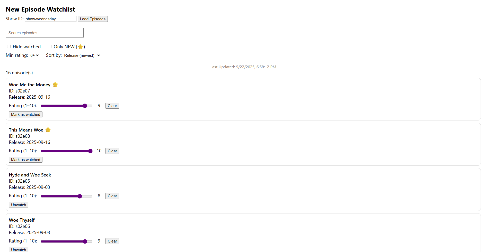

# New Episode Watchlist — Week 3

**Overview.** EventBridge (cron) → Producer Lambda → **SQS (`episodes-queue`)** (+ DLQ) → Worker Lambda → writes `flags/<showId>.json` in S3.  
API Lambda (`GET /episodes`) reads `feeds/` + `flags/` and the page shows ⭐ for recent episodes.

---

## How to Run

1) **Add/Update feed** → S3 data bucket: `episode-feeds-1jk32k/feeds/show1.json`.
2) **Refresh now (manual)** → Lambda `episode_producer_enqueue` → **Test** (empty event).  
   Worker writes `episode-feeds-1jk32k/flags/show1.json`.
3) **Open site** → CloudFront: https://d3nygn7m3cuned.cloudfront.net → type `show1` → **Load**.
4) **API check (optional)**  
   `GET https://8c7523bn7g.execute-api.us-east-1.amazonaws.com/episodes?showId=show1` → returns `{ count, items: [...] }`.
5) **Frontend changes?** Re-upload to `episode-site-kj324nd` and **CloudFront → Invalidations → Create →** "/*".

---

## Config (env vars)

**Producer**  
- `QUEUE_URL = https://sqs.us-east-1.amazonaws.com/773836683412/episodes-queue`  
- `SHOWS = show1`

**Worker**  
- `BUCKET = episode-feeds-1jk32k`  
- `FEEDS_PREFIX = feeds/`  
- `FLAGS_PREFIX = flags/`  
- `NEW_WINDOW_DAYS = 14`

**List/API**  
- `BUCKET = episode-feeds-1jk32k`  
- `FEEDS_PREFIX = feeds/`  
- `FLAGS_PREFIX = flags/`  
- `ALLOWED_ORIGIN = https://d3nygn7m3cuned.cloudfront.net`  
- `ALIASES = {"show-wednesday":"show1"}`

## Demo
